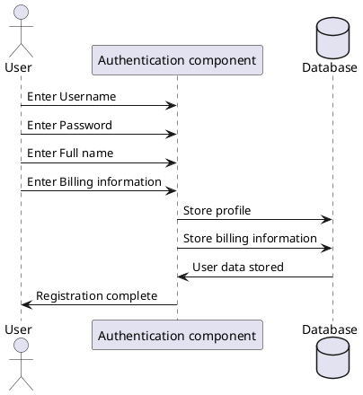

CSV-tiedoston datan tuominen PostgreSQL- tai MySQL-tietokantaan on suhteellisen helppoa käyttäen näiden tietokantajärjestelmien tarjoamia työkaluja ja komentoja. Tässä on yksinkertainen vaiheittainen ohje:

**CSV-tiedoston tuonti PostgreSQL-tietokantaan:**

1. **Valmistele CSV-tiedosto**: Varmista, että CSV-tiedostosi on valmis ja sisältää tarvittavat tiedot.

2. **Luo tietokanta ja taulu**: Varmista, että sinulla on PostgreSQL-tietokanta ja taulu, johon haluat tuoda datan. Voit luoda taulun käyttämällä SQL-komentoa:

   ```sql
   CREATE TABLE taulun_nimi (
       sarakkeen_nimi1 tyyppi1,
       sarakkeen_nimi2 tyyppi2,
       ...
   );
   ```

3. **Käytä `COPY`-komennon**: PostgreSQL tarjoaa `COPY`-komennon, joka mahdollistaa CSV-tiedoston nopean tuomisen tietokantaan. Voit käyttää sitä seuraavasti:

   ```sql
   COPY taulun_nimi(sarakkeen_nimi1, sarakkeen_nimi2, ...) FROM 'polku_tiedostoon.csv' DELIMITER ',' CSV HEADER;
   ```

   - `taulun_nimi`: Taulun nimi, johon data tuodaan.
   - `sarakkeen_nimi1, sarakkeen_nimi2, ...`: Taulun sarakkeet, joihin data vastaa.
   - `'polku_tiedostoon.csv'`: Polku CSV-tiedostoon.
   - `DELIMITER ','`: Määrittää käytetyn erotinmerkin (yleensä pilkku CSV:ssä).
   - `CSV HEADER`: Olettaa, että CSV-tiedosto sisältää otsikkorivin.

**CSV-tiedoston tuonti MySQL-tietokantaan:**

1. **Valmistele CSV-tiedosto**: Varmista, että CSV-tiedostosi on valmis ja sisältää tarvittavat tiedot.

2. **Luo tietokanta ja taulu**: Varmista, että sinulla on MySQL-tietokanta ja taulu, johon haluat tuoda datan. Voit luoda taulun käyttämällä SQL-komentoa:

   ```sql
   CREATE TABLE taulun_nimi (
       sarakkeen_nimi1 tyyppi1,
       sarakkeen_nimi2 tyyppi2,
       ...
   );
   ```

3. **Käytä `LOAD DATA INFILE`-komentoa**: MySQL tarjoaa `LOAD DATA INFILE`-komennon, joka mahdollistaa CSV-tiedoston tuomisen tietokantaan. Voit käyttää sitä seuraavasti:

   ```sql
   LOAD DATA INFILE 'polku_tiedostoon.csv' 
   INTO TABLE taulun_nimi 
   FIELDS TERMINATED BY ',' 
   ENCLOSED BY '"' 
   LINES TERMINATED BY '\n' 
   IGNORE 1 ROWS;
   ```

   - `'polku_tiedostoon.csv'`: Polku CSV-tiedostoon.
   - `taulun_nimi`: Taulun nimi, johon data tuodaan.
   - `FIELDS TERMINATED BY ','`: Määrittää käytetyn erotinmerkin (yleensä pilkku CSV:ssä).
   - `ENCLOSED BY '"'`: Määrittää käytetyn merkkijonon rajoittimen (yleensä lainausmerkki CSV:ssä).
   - `LINES TERMINATED BY '\n'`: Määrittää rivinvaihdon merkin (yleensä uusi rivi CSV:ssä).
   - `IGNORE 1 ROWS`: Ohittaa ensimmäisen rivin, joka yleensä sisältää otsikkotiedot.

Näiden vaiheiden avulla voit helposti tuoda CSV-tiedoston datan PostgreSQL- tai MySQL-tietokantaan. Muista tarkistaa, että tietokantataulun sarakkeiden määrä ja tyyppi vastaavat CSV-tiedoston tietoja ja mukauta tarvittaessa.


```Mermaid
sequenceDiagram
    actor User as U
    participant "Authentication component" as AC
    database Database as D

    U ->> AC : Enter Username
    U ->> AC : Enter Password
    U ->> AC : Enter Full name
    U ->> AC : Enter Billing information
    AC ->> D : Store profile
    AC ->> D : Store billing information
    D ->> AC : Provide profile id
    AC ->> U : Registration complete
```


