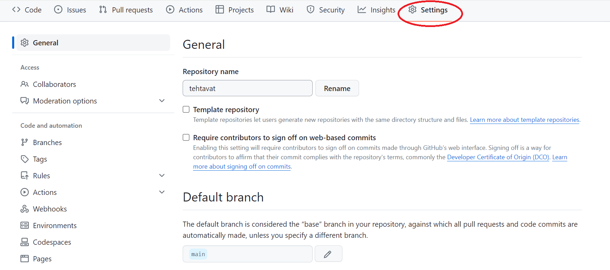
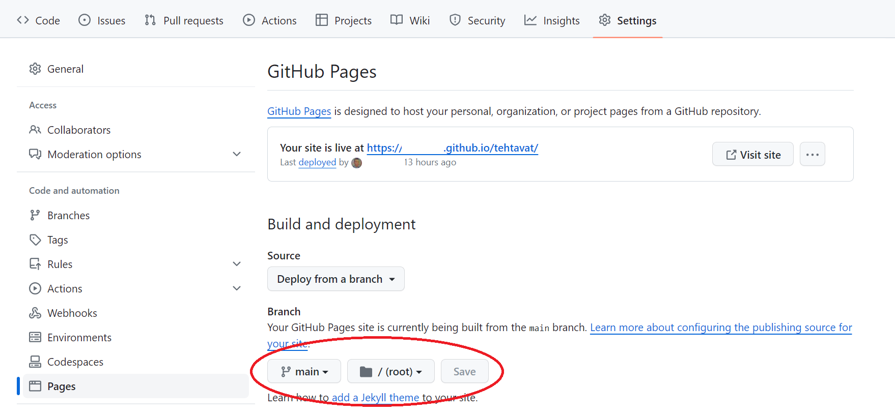
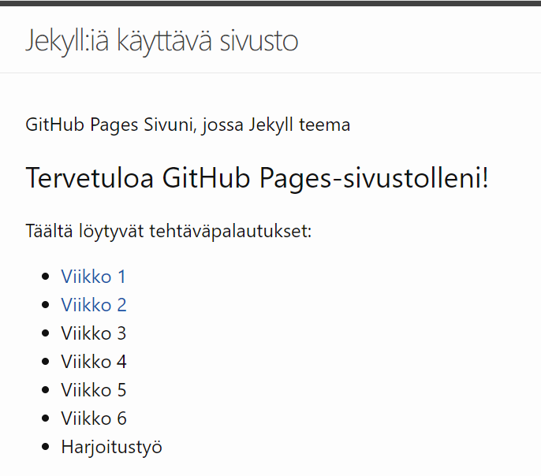

## Kurssin tehtävät

Arviointi: oppimistehtävät 60 % ja oma soveltava harjoitustyö 40 %.

Kurssilla on 6 oppimistehtävää, yksi tehtävä / opetusviikko ja jokaisen viikon tehtävän palautuspäivämäärä on kuluvan viikon sunnuntai klo 22. Myöhässä oppimistehtäviä voi palauttaa, mutta niistä vähennetään pisteitä kaavalla 10% vähennystä / viikko. Joidenkin tehtävien kohdalla käymme tehtävän haasteellisia kohtia läpi seuraavalla tunnilla ja opintojakson päätteeksi myös mallivastaukset tulevat näkyville. Yhdestä oppimistehtävästä saa max 6 p.  Yhteensä siis 6 x 6 p = 36 p.

[Harjoitustyöstä](https://github.com/Pilvipalvelut/web-kehityksessa/blob/main/harjoitustyo.md) saa parhaimmillaan 34 p ja se palautetaan opintojakson loppuun mennessä 16.12. klo 22.

##

### 1. Tehtävä

GitHub pages -sivuston rakentaminen

#### 1.1. Rekisteröidy GitHub:in käyttäjäksi
- Mene selaimella osoitteeseen: [GitHub Signup](https://github.com/signup)
- Täytä rekisteröitymistiedot lomakkeella
- Lue käyttöehdot ja hyväksy
- GitHub lähettää sähköpostilla vahvistusviestin, jossa on linkki johon täytyy mennä vahvistaaksesi että antamasi sähköpostiosoite on todellinen

#### 1.2. Luo uusi repository 
- Kirjaudu GitHub-tilillesi osoitteessa [GitHub](https://github.com)
- Siirry omalle profiilisivullesi oikeassa yläkulmassa olevasta profiili-ikonista
- Valitse Repositories-välilehti
- Paina Repositories-välilehdellä _New_-painiketta
- Täytä tiedot uudesta repositorysta
- Voit alkuun pitää repositorya Private-näkyvyystilassa kunnes se on valmis. Opintojakson aikana repositoryn tulee kuitenkin olla Public-näkyvyydellä

#### 1.3. Luo sivustolle uusi HTML-sivu
- Siirry repositoryn juureen eli avaa selaimella tyhjä repository
- Paina repositryn juuressa _Create new file_-painiketta
- Nimeä tiedosto nimellä _index.html_, joka on aloitussivun nimi
- Lisää tiedostoon tarvittavat sisällöt, esimerkiksi:
~~~
<!DOCTYPE html>
<html>
<head>
    <title>GitHub Pages Sivuni</title>
</head>
<body>
    <h1>Tervetuloa GitHub Pages-sivustolleni!</h1>
    
Tämä on ensimmäinen GitHub Pages -teksti.

</body>
</html>
~~~

#### 1.4. Luo sivustolle CSS-tiedosto, johon viittaat HTML-sivuista
- Tee samaan tapaan kuin edellisessä kohdassa uusi tiedosto
- Nimeä tiedosto nimellä _styles.css_ ja laita tarvittavat sisällöt, esimerkiksi:
~~~
body {
    background-color: #d2e2f2;
    font-family: Roboto, sans-serif;
}

h1 {
    color: #333;
}

.container {
    max-width: 960px;
    margin: 0 auto;
}
~~~
- Tallenna CSS-tiedosto
- Tee muutos HTML-sivulle, jotta määrittämäsi tyylitiedosto tulee käyttöön
~~~
<head>
    <link rel="stylesheet" type="text/css" href="styles.css">
</head>
~~~
#### 1.5. Muuta repository asetuksia
- Siirry repositoryn asetuksiin _Settings_, jossa määritellään GitHub Pages-sivuston asetukset. Ks. 
- Valitse _Settings_-sivun vasemmasta valikosta _Code and automation_ ja _Pages_-välilehti. Välilehdeltä voidaan merkitä julkaistavaksi _main_ branch, joka on ns. default kehityshaara repositoryssa. Ks. 
- Kun asetus on oikein tehty sivusto on näkyvillä ja linkki sivustoon tulee _Settings_-sivulle näkyviin
- Tarkista toisella selaimella tai incognito-tilassa miltä sivusto näyttää muille käyttäjille. Sivusto on osoitteessa: https://kayttajanimi.github.io/repositoryn-nimi
##

### 2. Tehtävä
#### 2.1. Jekyll-teema
Muunna GitHub Pages -sivustosi niin että HTML-sivujen sijaan käytetään md-tiedostoja ja Jekyll-teemaa. Saat lisää tietoa Jekyll-teemojen käyttämisestä [täältä](https://github.com/Pilvipalvelut/web-kehityksessa/blob/main/jekyll.md)

Jekyll-teemoja voi etsiä osoitteista
- [GitHub Themes](https://pages.github.com/themes/)
- [Jekyll Themes](https://jekyll-themes.com/)
#### 2.2. Linkkilista etusivulla jokaisen viikon tehtäväsivulle
Tee aloitussivulle (index) lista linkeistä, joilla pääsee tutustumaan tehtävä palautuksiin.

#### 2.3. Lyhyt kirjoitus
Tee viikolle 2 oma sivu (esimerkiksi vko2.md), jossa kuvailet miten Jekyll sivustoa voisi automatisoida käyttäen GitHub Actions-toimintoja. Vastaa myös millaisilla kehitystyökaluilla ja -tekniikoilla saataisiin CI/CD-putkisto rakennettua web-sovellukselle. Tekstimäärä noin 150 sanaa.
##

### 3. Tehtävä
#### 3.1. Vite + React -verkkosovellus
1. Tee Vite + React-verkkosovellus paikalliselle koneelle npm-paketinhallinta ohjelmalla
- Ohje Vite-sovelluksen muodostamiseta löytyy [täältä](https://vitejs.dev/guide/)
- Ohje React-sovelluksen muodostamisesta löytyy [täältä](https://create-react-app.dev/docs/getting-started)
2. Aja Vite-sovellukselle npm run build
3. Muuta js-tiedostojen polut relatiivisiksi kuvien toimivuuden takia, esimerkiksi reactLogo from './react.svg'
4. Siirrä dist-kansion sisältö GitHub Pages -sivustolle kansioon vko3. Assets kansion sisältö kannattaa laittaa samaan kansioon

#### Palautuksena Teams:iin viikon 3 linkki kun Vite + React -sovellus on saatu vietyä sivustolle.
##

### 4. Tehtävä

#### 4.1. Firebase-tietokanta
1. Tee luentomateriaalin ohjeiden  mukainen Firebase-tietokanta ja konfiguraatio sovelluksen käyttämiseksi. 
2. Asenna Firabase-tools paketti paikallisen koneen komentorivillä. Ohjeita voi katsoa [täältä](https://firebase.google.com/docs/cli)

#### 4.2. Firebase-autentikointi
Konfiguroi 3.1. kohdassa tehty verkkosovellus käyttämään Firebase-autentikaatiota.
Tee sovellukselle tiedosto firebaseConfig.ts johon tulee tiedot Firebasestasi
~~~
const firebaseConfig = {
    apiKey: "xyz!#¤%&/",
    authDomain: "pilvi-react.firebaseapp.com",
    projectId: "pilvi-react",
    storageBucket: "pilvi-react.appspot.com",
    messagingSenderId: "123456",
    appId: "1:123456:web:789abcdef",
  };

export default firebaseConfig;
~~~
Tee uusi TypeScript-komponentti LoginForm (src-kansioon tulee LoginForm.tsx tiedosto), johon tulee alla oleva koodi:
~~~
import React, { useState } from "react";
import { signInWithEmailAndPassword } from "firebase/auth";
import { initializeApp } from "firebase/app";
import { getAuth } from "firebase/auth";
import firebaseConfig from "../firebaseConfig";

function LoginForm() {
  const app = initializeApp(firebaseConfig);
  const auth = getAuth(app);
    
  const [email, setEmail] = useState<string>("");
  const [password, setPassword] = useState<string>("");

  const handleLogin = async (event: React.FormEvent<HTMLFormElement>) => {
    event.preventDefault();
        await signInWithEmailAndPassword(auth, email, password) 
            .then((userCredential) => {
                // Signed in
                const user = userCredential.user;
                console.log('User signed in:', user.email);
            })
            .catch((error) => {
                const errorCode = error.code;
                const errorMessage = error.message;
                console.error('Error signing in:', errorCode, errorMessage);
            });       
  }

  return (
    

      <form onSubmit={handleLogin}>
        

          <label htmlFor="email">Sähköposti:</label>
          <input
            type="email"
            id="email"
            value={email}
            onChange={(e) => setEmail(e.target.value)}
            required
          />
        

        

          <label htmlFor="password">Salasana:</label>
          <input
            type="password"
            id="password"
            value={password}
            onChange={(e) => setPassword(e.target.value)}
            required
          />
        

        <button type="submit">Kirjaudu sisään</button>
      </form>
    

  );
}

export default LoginForm;
~~~
##

### 5. Tehtävä
1. Tee uusi seurattava sivusto Matomon käyttöliittymällä. 
2. Laita sivustolle keksi [Matomon ohjeistuksen](https://matomo.org/faq/new-to-piwik/how-do-i-start-tracking-data-with-matomo-on-websites-that-use-react/) mukaisesti.
3. Tee viikolle 5 oma sivu (esimerkiksi vko5.md), jossa kuvailet miten analyytiikkaa voisi hyödyntää sivustollasi ja esimerkiksi harjoitustehtävässä. Tekstimäärä noin 100 sanaa.
~~~
  useEffect(() => {  
    var _mtm = window._mtm = window._mtm || [];
    _mtm.push({'mtm.startTime': (new Date().getTime()), 'event': 'mtm.Start'});
    const d=document, g=d.createElement('script'), s: HTMLScriptElement=d.getElementsByTagName('script')[0];
    g.async=true; g.src='https://pilvipalvelut-matomo.2.rahtiapp.fi/js/container_{{omakoodi}}.js'; 
    if (s && s.parentNode) {
      s.parentNode.insertBefore(g,s);
    }
  }, []);

    return (
        

            <h1>Hello World</h1>
        

    )
   }
~~~   
##

### 6. Tehtävä
Tee sivustolle toiminto, joka hakee tietoa sivuston käytöstä viimeisen 30 päivän ajalta Matomon API:n kautta. Opas Matomo API:n käyttämiseen [täältä](https://developer.matomo.org/api-reference/reporting-api).

~~~
import axios from 'axios';

# Matomo API osoite
  React.useEffect(() => {  
    const token = 'kysy token'
    const fetchData = async () => {
      try {

       //const response = await axios.get('https://pilvipalvelut-matomo.2.rahtiapp.fi/index.php?module=API&method=VisitsSummary.get&idSite=1&period=day&date=last30&format=json&token_auth=${token}');
        const response = await axios.get('https://dummyjson.com/products');
        if (response.status === 200) {
          const data = await response.data
          console.log(data)
          setProducts(data.products)
        }
      } catch (error) {
        console.error('Virhe tietojen haussa:', error);
      }
    };

    fetchData();  
  }, []);
  const [products, setProducts] = useState<[]>([]);
~~~
Jos Matomon tietojen saaminen ei onnistu niin mikä tahansa muu REST API tietojen näyttäminen käy.
ProductList.tsx haku FireStore kannasta

~~~
import { useState, useEffect } from 'react';
import { getFirestore, getDocs, collection, addDoc } from 'firebase/firestore';
import { initializeApp } from 'firebase/app';
import firebaseConfig from '../firebaseConfig';

interface Product {
    id: string;
    name: string;
    price: number;
}

function ProductList() {
    const app = initializeApp(firebaseConfig);
    const db = getFirestore(app);
    const [products, setProducts] = useState<Product[]>([]);
    const [newName, setNewName] = useState<string>('');
    const [newPrice, setNewPrice] = useState<number>(0);

    const fetchDataFromFs = async () => {
        const querySnapshot = await getDocs(collection(db, "product"));
        const fetchedData: Product[] = [];
        querySnapshot.forEach((doc) => {
            const docData = doc.data() as Product;
            fetchedData.push( docData );
        });
        setProducts(fetchedData);
    };

    useEffect(() => {
        fetchDataFromFs();
    }, []);

    const addProduct = async () => {
        if (newName) {
            const newProduct: Product = { id: '', name: newName, price: newPrice };
            const docRef = await addDoc(collection(db, 'product'), newProduct);
            setProducts([...products, { ...newProduct, id: docRef.id }]);
            console.log("Uuden tuotteen Ref Id on " + docRef.id);
            setNewName("");  // Tyhjennetään syötekenttä
            setNewPrice(0);  // Tyhjennetään syötekenttä
            fetchDataFromFs();  // Päivitetään tiedot
        }
    };

    const handleInputChange = (event: React.ChangeEvent<HTMLInputElement>) => {
        if (event.target.placeholder === "Tuotteen nimi") {
            setNewName(event.target.value.toString());
        } else if (event.target.placeholder === "Tuotteen hinta") {
            setNewPrice(parseFloat(event.target.value.toString()));
        }
    }

    return (
        

            <h2>Tuotteet</h2>
                <table style={{ borderCollapse: "collapse", width: "100%" }}>
                    <thead>
                        <tr>
                        <th>ID</th>
                        <th>Nimi</th>
                        <th>Hinta</th>
                        </tr>
                    </thead>
                    <tbody>
                        {products.map((product) => (
                        <tr>
                            <td>{product.id}</td>
                            <td>{product.name}</td>
                            <td>{product.price}</td>
                        </tr>
                        ))}
                    </tbody>
                </table>
                <h3>Lisää uusi tuote</h3>
                

                    Nimi:
                    <input type="text" value={newName} onChange={handleInputChange}
                    placeholder="Tuotteen nimi" />
                    Hinta:
                    <input type="text" value={newPrice} onChange={handleInputChange}
                    placeholder="Tuotteen hinta" />                 
                    <button onClick={addProduct}>
                        Lisää tuote
                    </button>
                

        

    );

};

export default ProductList;
~~~
