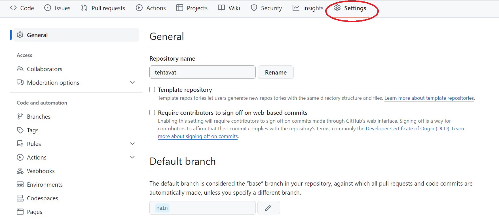
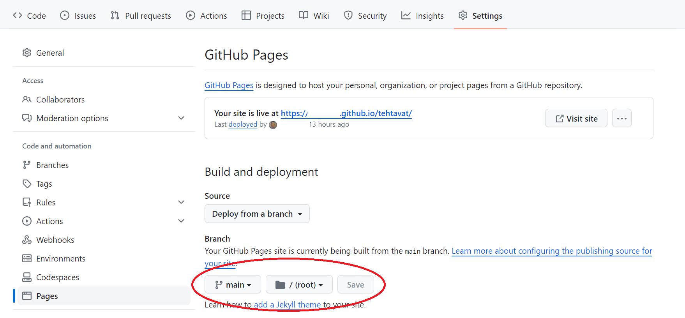

## Kurssin tehtävät

Arviointi: oppimistehtävät 51 % ja oma soveltava harjoitustyö 49 %.

Kurssilla on 6 oppimistehtävää, yksi tehtävä / opetusviikko ja jokaisen viikon tehtävän palautuspäivämäärä on kuluvan viikon sunnuntai klo 22. Myöhässä oppimistehtäviä voi palauttaa, mutta niistä vähennetään pisteitä kaavalla 10% vähennystä / viikko. Joidenkin tehtävien kohdalla käymme tehtävän haasteellisia kohtia läpi seuraavalla tunnilla ja opintojakson päätteeksi myös mallivastaukset tulevat näkyville. Yhdestä oppimistehtävästä saa max 6 p.  Yhteensä siis 6 x 6 p = 36 p.

[Harjoitustyöstä](https://github.com/Pilvipalvelut/web-kehityksessa/blob/main/harjoitustyo.md) saa parhaimmillaan 34 p ja se palautetaan opintojakson loppuun mennessä 17.5. klo 22.

##

### 1. Tehtävä

GitHub pages -sivuston rakentaminen

#### 1.1. Rekisteröidy GitHub:in käyttäjäksi
- Mene selaimella osoitteeseen: [GitHub Signup](https://github.com/signup)
- Täytä rekisteröitymistiedot lomakkeella
- Lue käyttöehdot ja hyväksy
- GitHub lähettää sähköpostilla vahvistusviestin, jossa on linkki johon täytyy mennä vahvistaaksesi että antamasi sähköpostiosoite on todellinen

#### 1.2. Luo uusi repository 
- Kirjaudu GitHub-tilillesi osoitteessa [GitHub](https://github.com)
- Siirry omalle profiilisivullesi oikeassa yläkulmassa olevasta profiili-ikonista
- Valitse Repositories-välilehti
- Paina Repositories-välilehdellä _New_-painiketta
- Täytä tiedot uudesta repositorysta
- Voit alkuun pitää repositorya Private-näkyvyystilassa kunnes se on valmis. Opintojakson aikana repositoryn tulee kuitenkin olla Public-näkyvyydellä

#### 1.3. Luo sivustolle uusi HTML-sivu
- Siirry repositoryn juureen eli avaa selaimella tyhjä repository
- Paina repositryn juuressa _Create new file_-painiketta
- Nimeä tiedosto nimellä _index.html_, joka on aloitussivun nimi
- Lisää tiedostoon tarvittavat sisällöt, esimerkiksi:
~~~
<!DOCTYPE html>
<html>
<head>
    <title>GitHub Pages Sivuni</title>
</head>
<body>
    <h1>Tervetuloa GitHub Pages-sivustolleni!</h1>
    
Tämä on ensimmäinen GitHub Pages -teksti.

</body>
</html>
~~~

#### 1.4. Luo sivustolle CSS-tiedosto, johon viittaat HTML-sivuista
- Tee samaan tapaan kuin edellisessä kohdassa uusi tiedosto
- Nimeä tiedosto nimellä _styles.css_ ja laita tarvittavat sisällöt, esimerkiksi:
~~~
body {
    background-color: #d2e2f2;
    font-family: Roboto, sans-serif;
}

h1 {
    color: #333;
}

.container {
    max-width: 960px;
    margin: 0 auto;
}
~~~
- Tallenna CSS-tiedosto
- Tee muutos HTML-sivulle, jotta määrittämäsi tyylitiedosto tulee käyttöön
~~~
<head>
    <link rel="stylesheet" type="text/css" href="styles.css">
</head>
~~~
#### 1.5. Muuta repository asetuksia
- Siirry repositoryn asetuksiin _Settings_, jossa määritellään GitHub Pages-sivuston asetukset. Ks. 
- Valitse _Settings_-sivun vasemmasta valikosta _Code and automation_ ja _Pages_-välilehti. Välilehdeltä voidaan merkitä julkaistavaksi _main_ branch, joka on ns. default kehityshaara repositoryssa. Ks. 
- Kun asetus on oikein tehty sivusto on näkyvillä ja linkki sivustoon tulee _Settings_-sivulle näkyviin
- Tarkista toisella selaimella tai incognito-tilassa miltä sivusto näyttää muille käyttäjille. Sivusto on osoitteessa: https://kayttajanimi.github.io/repositoryn-nimi
##

### 2. Tehtävä
TBD
##

### 3. Tehtävä
TBD
##

### 4. Tehtävä
TBD
##

### 5. Tehtävä
TBD
##

### 6. Tehtävä
TBD
##