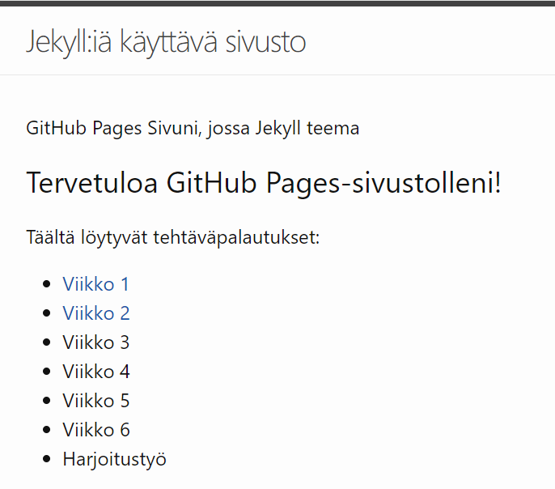

## Kurssin tehtävät

Arviointi: oppimistehtävät 51 % ja oma soveltava harjoitustyö 49 %.

Kurssilla on 6 oppimistehtävää, yksi tehtävä / opetusviikko ja jokaisen viikon tehtävän palautuspäivämäärä on kuluvan viikon sunnuntai klo 22. Myöhässä oppimistehtäviä voi palauttaa, mutta niistä vähennetään pisteitä kaavalla 10% vähennystä / viikko. Joidenkin tehtävien kohdalla käymme tehtävän haasteellisia kohtia läpi seuraavalla tunnilla ja opintojakson päätteeksi myös mallivastaukset tulevat näkyville. Yhdestä oppimistehtävästä saa max 6 p.  Yhteensä siis 6 x 6 p = 36 p.

[Harjoitustyöstä](https://github.com/Pilvipalvelut/web-kehityksessa/blob/main/harjoitustyo.md) saa parhaimmillaan 34 p ja se palautetaan opintojakson loppuun mennessä 17.5. klo 22.

##

### 1. Tehtävä

GitHub pages -sivuston rakentaminen

#### 1.1. Rekisteröidy GitHub:in käyttäjäksi
- Mene selaimella osoitteeseen: [GitHub Signup](https://github.com/signup)
- Täytä rekisteröitymistiedot lomakkeella
- Lue käyttöehdot ja hyväksy
- GitHub lähettää sähköpostilla vahvistusviestin, jossa on linkki johon täytyy mennä vahvistaaksesi että antamasi sähköpostiosoite on todellinen

#### 1.2. Luo uusi repository 
- Kirjaudu GitHub-tilillesi osoitteessa [GitHub](https://github.com)
- Siirry omalle profiilisivullesi oikeassa yläkulmassa olevasta profiili-ikonista
- Valitse Repositories-välilehti
- Paina Repositories-välilehdellä _New_-painiketta
- Täytä tiedot uudesta repositorysta
- Voit alkuun pitää repositorya Private-näkyvyystilassa kunnes se on valmis. Opintojakson aikana repositoryn tulee kuitenkin olla Public-näkyvyydellä

#### 1.3. Luo sivustolle uusi HTML-sivu
- Siirry repositoryn juureen eli avaa selaimella tyhjä repository
- Paina repositryn juuressa _Create new file_-painiketta
- Nimeä tiedosto nimellä _index.html_, joka on aloitussivun nimi
- Lisää tiedostoon tarvittavat sisällöt, esimerkiksi:
~~~
<!DOCTYPE html>
<html>
<head>
    <title>GitHub Pages Sivuni</title>
</head>
<body>
    <h1>Tervetuloa GitHub Pages-sivustolleni!</h1>
    <p class="container">Tämä on ensimmäinen GitHub Pages -teksti.</p>
</body>
</html>
~~~

#### 1.4. Luo sivustolle CSS-tiedosto, johon viittaat HTML-sivuista
- Tee samaan tapaan kuin edellisessä kohdassa uusi tiedosto
- Nimeä tiedosto nimellä _styles.css_ ja laita tarvittavat sisällöt, esimerkiksi:
~~~
body {
    background-color: #d2e2f2;
    font-family: Roboto, sans-serif;
}

h1 {
    color: #333;
}

.container {
    max-width: 960px;
    margin: 0 auto;
}
~~~
- Tallenna CSS-tiedosto
- Tee muutos HTML-sivulle, jotta määrittämäsi tyylitiedosto tulee käyttöön
~~~
<head>
    <link rel="stylesheet" type="text/css" href="styles.css">
</head>
~~~
#### 1.5. Muuta repository asetuksia
- Siirry repositoryn asetuksiin _Settings_, jossa määritellään GitHub Pages-sivuston asetukset. Ks. 
- Valitse _Settings_-sivun vasemmasta valikosta _Code and automation_ ja _Pages_-välilehti. Välilehdeltä voidaan merkitä julkaistavaksi _main_ branch, joka on ns. default kehityshaara repositoryssa. Ks. 
- Kun asetus on oikein tehty sivusto on näkyvillä ja linkki sivustoon tulee _Settings_-sivulle näkyviin
- Tarkista toisella selaimella tai incognito-tilassa miltä sivusto näyttää muille käyttäjille. Sivusto on osoitteessa: https://kayttajanimi.github.io/repositoryn-nimi

#### 1.6. Linkkilista etusivulla jokaisen viikon tehtäväsivulle
- Tee aloitussivulle (index) lista linkeistä, joilla pääsee tutustumaan tehtävä palautuksiin.

##

### 2. Tehtävä
**Tehtävä: Koodikielen ja suunnittelumallien automaattinen tunnistus GitHub Actionsilla**

🎯 **Oppimistavoitteet**

Tämän tehtävän suoritettuaan opiskelija osaa:

*   Rakentaa GitHub Actions -workflow ja konfiguroida sen ajastuksen ja/tai tapahtumatriggerin mukaan
*   Kirjoittaa skriptin, joka analysoi GitHub-repositorion sisältöä
*   Tunnistaa koodin ohjelmointikielen (tai kielet)
*   Etsiä yleisiä suunnittelumalleja (design patterns) koodista
*   Tuottaa analyysin workflow’n lokiin ja mahdollisesti artefaktiksi

## 📝 **Tehtävän kuvaus**

Luo GitHub-repositorioon automaattinen analysointijärjestelmä, joka:

1.  **Tunnistaa repositoriossa käytetyt ohjelmointikielet**
2.  **Tarkistaa, esiintyykö koodissa klassisia ohjelmistosuunnittelun malleja**  
    (esim. Singleton, Factory Method, Strategy, Observer, Decorator)
3.  **Tulostaa analyysiraportin** GitHub Actions -workflow’n lokiin  
    – ja valinnaisesti tallentaa sen artefaktiksi.

# 🛠️ **Tekniset vaatimukset**

2.1. GitHub Actions -workflow

Luo hakemistoon `.github/workflows/` tiedosto nimeltä esimerkiksi `analysis.yml`, joka:

*   Ajoitetaan suoritettavaksi aina kun:
    *   koodia pusketaan (`push`)
    *   tehdään `pull_request`
*   Suorittaa opiskelijan kirjoittaman analyysiskriptin

Esimerkki workflow-runnerista (opiskelijat muokkaavat itse tarpeidensa mukaan):

```yaml
name: Repository Analysis

on:
  push:
  pull_request:

jobs:
  analyze:
    runs-on: ubuntu-latest
    steps:
      - name: Checkout repository
        uses: actions/checkout@v4

      - name: Run analysis script
        run: |
          chmod +x analysoi.sh
          ./analysoi.sh

      - name: Upload report
        uses: actions/upload-artifact@v4
        with:
          name: analysis-report
          path: analysis_report.txt
```

2.2. Analyysiskripti

Tee repositorioon tiedosto `analysoi.sh` (tai `analysoi.py`, jos haluat antaa vaihtoehdon), joka:

### Selvittää käytetyt ohjelmointikielet

Vaihtoehtoja:

*   lukea GitHubin automaattisesti generoimaa `languages`-tietoa (esim. `gh` CLI tai lukemalla kooditiedostojen päätteitä)
*   analysoida tiedostopäätteitä käsin  
    (esim. `.py`, `.js`, `.java`, `.cpp` jne.)

Esimerkki erittäin yksinkertaisesta shell-tavasta:

```bash
echo "Detected languages:"
find . -type f -name "*.py" | grep -q . && echo "- Python"
find . -type f -name "*.java" | grep -q . && echo "- Java"
find . -type f -name "*.js" | grep -q . && echo "- JavaScript"
```

### Havaitsee yleisiä suunnittelumalleja

Tämä ei tarvitse olla täydellinen — tavoitteena on **heuristiikkapohjainen** tunnistus.

Esimerkki heuristiikoista:

| Suunnittelumalli | Heuristiikka                                                          |
| ---------------- | --------------------------------------------------------------------- |
| Singleton        | Tiedosto sisältää sanan `getInstance` tai `static instance`           |
| Factory Method   | Esiintyy `create*` tai `factory`                                      |
| Strategy         | Luokkanimi *Strategy* tai hakusana `interface` tietyissä tiedostoissa |
| Observer         | Esiintyy sanat `notify`, `subscribe`, `observer`                      |
| Decorator        | Luokkanimissä esiintyy *Decorator*, tai “wrap”-tyyppisiä metodeja     |

Esimerkki shell-heuristiikasta:

```bash
echo "Design patterns detected:" > analysis_report.txt

grep -R "getInstance" -n . && echo "- Singleton" >> analysis_report.txt
grep -R "create[A-Z]" -n . && echo "- Factory Method" >> analysis_report.txt
grep -R "notify" -n . && echo "- Observer" >> analysis_report.txt
grep -R "Strategy" -n . && echo "- Strategy" >> analysis_report.txt
grep -R "Decorator" -n . && echo "- Decorator" >> analysis_report.txt
```

Raportin voi myös generoida markdown-muotoon.

2.3. Raportointi

*   Raportti tulostetaan GitHub Actions -lokiin
*   Raportti tallennetaan tiedostoon `analysis_report.txt`
*   Tiedosto tallennetaan artefaktiksi (vapaaehtoinen)

# 🎓 **Palautettava materiaali**

Palautuksena tehtävästä on Teams-kanavalle **GitHub-repositorion linkki**, jossa on workflow-tiedosto `.github/workflows/analysis.yml`

##

### 3. Tehtävä
TBD
##

### 4. Tehtävä
TBD
##

### 5. Tehtävä
TBD
##

### 6. Tehtävä
TBD
##