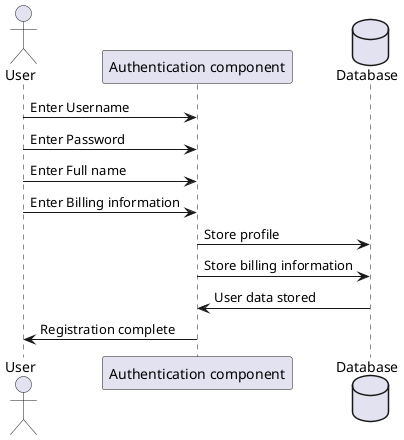

```Mermaid
sequenceDiagram
    actor User as U
    participant "Authentication component" as AC
    database Database as D

    U ->> AC : Enter Username
    U ->> AC : Enter Password
    U ->> AC : Enter Full name
    U ->> AC : Enter Billing information
    AC ->> D : Store profile
    AC ->> D : Store billing information
    D ->> AC : Provide profile id
    AC ->> U : Registration complete
```


